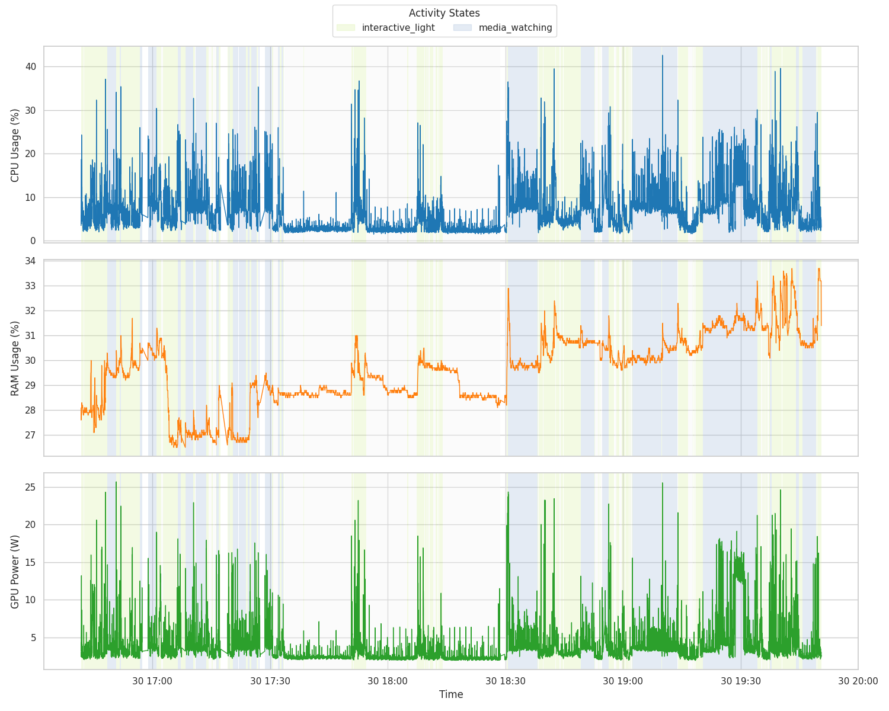

>[!NOTE]
>Most of my work happens in local prototypes and planning; I value a clean, working final product over a high commit count.

# System State Forecast

[View the Presentation (PDF)](final_recording_script/presentation/diatypst/google_studio.pdf) for a more finished overview of this project.

## Project Overview

**Goal:** Develop a machine learning system to classify the computer's current state into **Idle**, **Interactive (Light)**, or **Media Watching** in real-time.

**Motivation:** Predicting system peaks (like high CPU usage) solely based on history is very difficult due to random user intent. Instead, this project pivots to classifying the **User State** relying **exclusively on system resource metrics** (CPU, RAM, Disk, Network, GPU). It purposefully avoids invasive input monitoring (key/mouse logging) during production for privacy.

**How it works:** 
A Random Forest classifier is trained on rolling statistical features (Mean/Std Dev) over 5s and 30s windows of system metrics. The system achieved ~83% accuracy. A major challenge, distinguishing "Idle" from "Light Interactive" reading states, was solved by analyzing micro-spikes in maximum GPU engine utilization (`max_gpu`) and applying heuristic overrides based on deep GPU sleep states (`RC6`).



The system architecture comprises:
1. **Data Collection:** `10_comprehensive_activity_log.py` runs as a daemon collecting `psutil` and `intel_gpu_top` metrics.
2. **Model Training:** `train_model.py` engineers features and trains the Random Forest, outputting a serialized model.
3. **Live Inference:** `live_inference.py` tails the system metrics, engineers features in real-time, and predicts the user state (with hard-logic heuristic overrides for the "Idle" state).

## Setup Instructions

### 1. System Requirements & Dependencies

This project is tested on Linux (specifically Arch Linux + Niri).

**System Packages:**
Install the following via your OS package manager:
*   `intel-gpu-tools` (Provides `intel_gpu_top` for crucial GPU metrics)
*   `libinput-tools` (Only required for initial labeled data collection via `libinput debug-events`)

**Python Environment:**
The project uses `uv` for dependency management and requires Python >= 3.12.
To install the dependencies, run:
```bash
uv sync
```

### 2. Permissions

To allow the data collector to read GPU metrics without needing `sudo` every time:
```bash
sudo setcap cap_perfmon+ep /usr/bin/intel_gpu_top
```

### 3. Running the System

The main ML pipeline scripts are located in the `final_recording_script/` directory.

**Step 1: Data Collection (Background Daemon)**
This must be running to feed real-time metric data to the system and write to the CSV log.
```bash
cd final_recording_script
sudo uv run 10_comprehensive_activity_log.py
```
*(Note: `sudo` might be required depending on `intel_gpu_top` capabilities).*

**Step 2: Live Inference (Production)**
Run the inference engine. It tails the logs, runs predictions, and triggers system notifications (via `notify-send`) on state change.
```bash
cd final_recording_script
uv run system_only_model/live_inference.py
```

**Step 3: Retraining the Model (Optional/Maintenance)**
If you gather more labeled data and want to retrain the Random Forest model:
```bash
cd final_recording_script/system_only_model
uv run train_model.py
```

---
*Note: Early exploration scripts (`main.py`, `THU.py`, `unified_logger.py`, etc.) are kept in the root, while the final refined ML pipeline lives inside `final_recording_script/`.*
